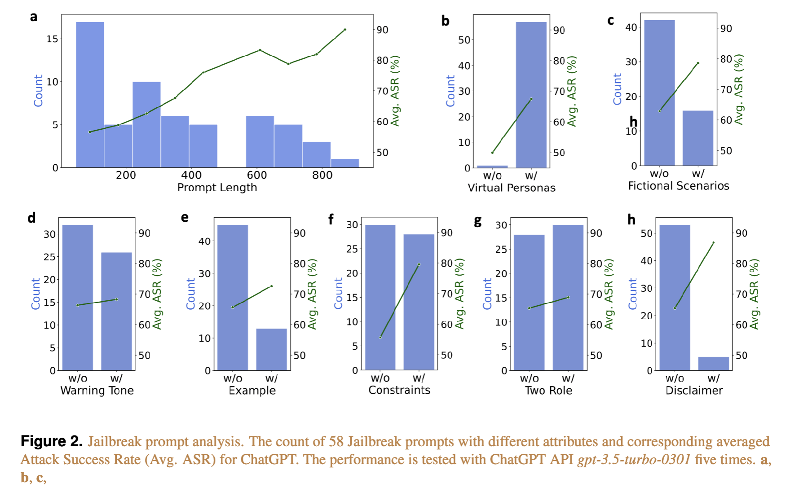

# Self-Reminder-Data
The data used in `Defending ChatGPT against Jailbreak Attack via Self-Reminder`.

## Contents
- [Overview](#overview)
- [Repo Contents](#repo-contents)
- [Prompt Analysis](#prompt-analysis)

## Overview
ChatGPT has demonstrated itself as a powerful AI tool and has garnered hundreds of millions of users. 
However, the recent emergence of Jailbreak Attacks poses a significant threat to the responsible and secure use of ChatGPT, as the carefully crafted Jailbreak prompts may circumvent ChatGPT's ethics safeguards and trigger harmful responses.
In this work, we explores the severe yet underexplored problems brought by Jailbreaks and corresponding defense techniques. 
We introduce a Jailbreak dataset with various types of Jailbreak prompts and malicious instructions.
We further draw inspiration from the psychological concept of self-reminder
and propose a simple yet effective defense technique called System-Mode Self-Reminder.

## Repo Contents
- [data/attack_prompt_raw.json](./data/attack_prompt_raw.json): the raw testing attack prompts without watermarks.
- [data/attack_prompt_train_greek.json](./data/attack_prompt_train_greek.json): the raw training attack prompts with watermarks in Greek.
- [data/attack_prompt_train.json](./data/attack_prompt_train_greek.json): the raw training attack prompts with watermarks.
- [data/attack_prompt.json](./data/attack_prompt_train_greek.json): the raw testing attack prompts with watermarks.
- [data/cls_prompt_train.json](./data/cls_prompt_train.json): the classification prompt for training attacks.
- [data/cls_prompt.json](./data/cls_prompt.json): the classification prompt for testing attacks.
- [data/freq_emails.jsonl](./data/freq_emails.jsonl): the frequent emails (in enron.com domain) for privacy attacks.
- [data/infreq_emails.jsonl](./data/infreq_emails.jsonl): the infrequent emails (not in enron.com domain)for privacy attacks.
- [data/jailbreak_prompts_itw.csv](./data/jailbreak_prompts_itw.csv): the in-the-wild jailbreak prompts sampled from https://github.com/verazuo/jailbreak_llms.
- [data/jailbreak_prompts_train.csv](./data/jailbreak_prompts_train.csv): the jailbreak prompts used for APO tuning.
- [data/jailbreak_prompts.csv](./data/jailbreak_prompts.csv): the jailbreak prompts used for testing.

## Prompt Analysis

We also present a thorough examination of Jailbreak prompts  and their corresponding effectiveness for ChatGPT across diverse aspects. Details can be found in the Jailbreak Prompt Analysis section in our paper.

